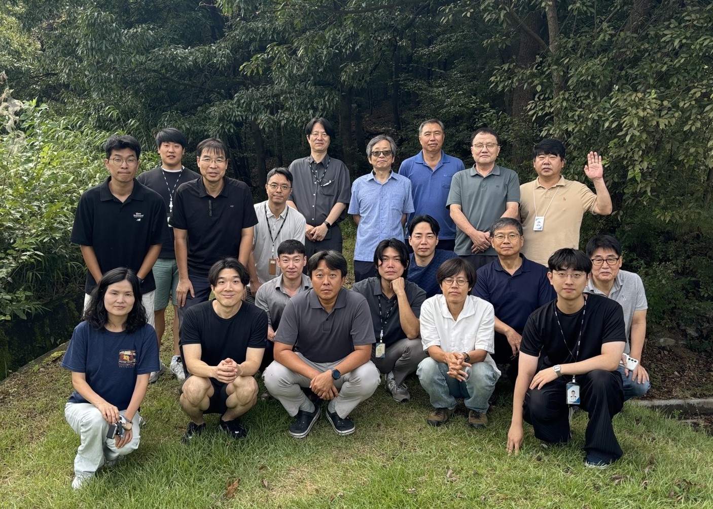

<br/>

## About me

**Minjae Kim** is a **_researcher_** of [KAERI](https://www.kaeri.re.kr/) (Korean government-funded national research institute). He diagnoses and predicts the failure of multiphysics system with deep learning frameworks.

He has a broad technical background in Prognostics and Health Management of complex multiphysics system, deep learning, signal processing, and computational fluid dynamics. He has written 3 international [research papers](https://scholar.google.com/citations?user=Clgn1SoAAAAJ&hl=en) in his area. His research has been presented in several conferences.

He is now carrying research on developing primary system of Multi-purpose Small Modular Reactor.

He is a self-motivated and proactive researcher eager to contribute to this society with what he have learned.

He also loves to bring new ideas and share it with collaborators.



## Contact

```
Affiliation: Multi-purpose Small Reactor System Development Division, Korea Atomic Energy Research Institute (KAERI)
Office: 111, Daedeok-daero 989beon-gil, Yuseong-gu, Daejeon, 34057, Republic of Korea
Email: mintree9@kaeri.re.kr or mintree8@gmail.com
```
