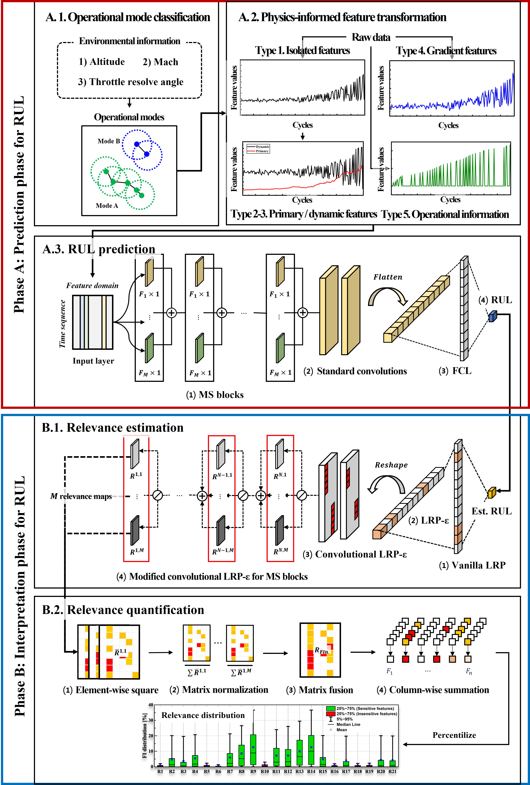

 

# Writing sample

### Explore my newest research paper, where I delve into advanced AI methods to solve real-world challenges!

**- Title: Physics-Informed Deep Learning for Explainable Remaining Useful Life Prediction (Under 2nd revision @ Eng. App. of AI, JCR Top 2%)**

**- Manuscript : Version after its 1st revision [[pdf]](https://drive.google.com/file/d/1XAs6LS1Yx83Ps_4Eb0zINzDuB4DDEpkB/view?usp=drive_link)**

**- Response to 5 reviewers : [[pdf]](https://drive.google.com/file/d/1BpZyeMK6PVN5mJ6tFajzJGt-YDsYNJyF/view?usp=drive_link)**

 
